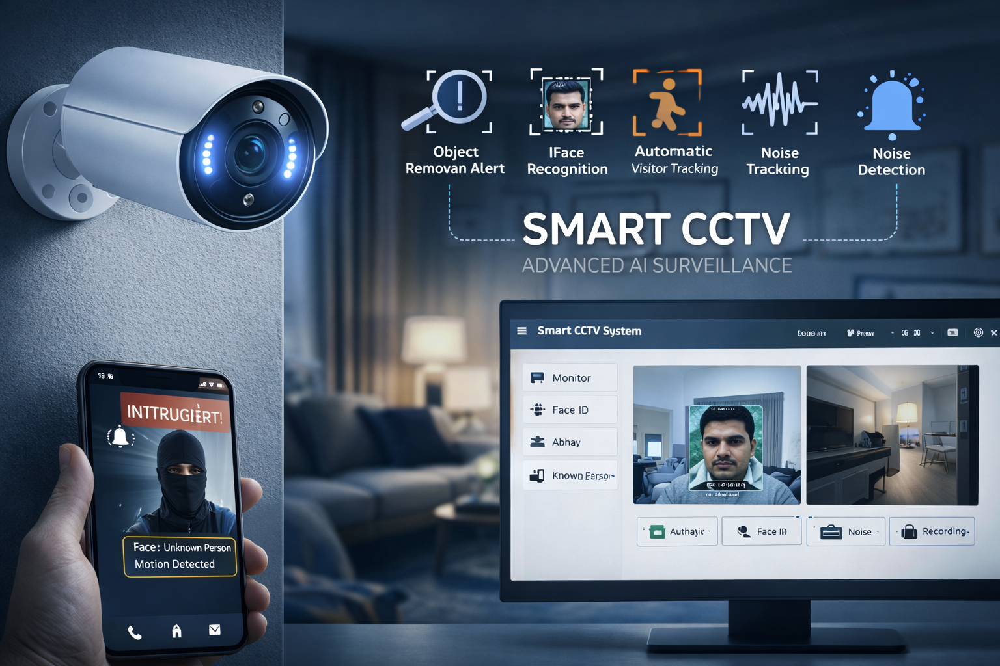

# 🎥 Smart CCTV: An Integrated approach of Computer Vision and Machine Learning for Advanced Surveillance

A **Smart CCTV surveillance system** that enhances traditional video monitoring by integrating **computer vision and machine learning techniques** to enable **face recognition, motion detection, object monitoring, noise detection, and visitor tracking** in real time. The system is implemented as a **Python-based GUI application** and operates on live webcam input.

---

## 📌 Project Overview

Conventional CCTV systems rely heavily on manual monitoring and post-incident analysis, which is time-consuming and prone to human error. This project introduces a **Smart CCTV system** that automates surveillance tasks using **image processing and ML algorithms**, thereby improving **security, crime prevention, and operational efficiency**.

The system continuously analyzes video frames to detect motion, recognize faces, identify removed or misplaced objects, and track visitors entering or leaving the monitored area.

---

## 🎯 Objectives

- Automate CCTV surveillance using computer vision  
- Detect motion and removed objects in real time  
- Identify known and unknown individuals using face recognition  
- Detect image noise and unusual activity  
- Capture and store evidence automatically  
- Reduce dependency on manual monitoring  

---

## 🧠 Key Features

- 👤 **Face Recognition** using LBPH algorithm  
- 🎯 **Object & Motion Detection** using SSIM  
- 🔊 **Noise Detection** via frame differencing  
- 🚶 **Visitor In–Out Detection**  
- 🖥️ **Python GUI Application** for easy operation  
- 📁 Automatic image and data storage  
- 💡 Works in low-light conditions  

---

## ⚙️ System Architecture

**Webcam → Image Processing → ML Algorithms → GUI → Storage & Alerts**

- Webcam captures live video feed  
- Frames are processed using OpenCV  
- ML models analyze faces and motion  
- GUI displays results and controls features  
- Images and data are saved locally  

---

## 🧩 Technology Stack

### Software
- Python  
- OpenCV  
- NumPy  
- Scikit-image (SSIM)  
- Tkinter (GUI)  

### Hardware
- PC / Laptop  
- Integrated or external webcam  

---

## 🔄 Working Principle

1. Webcam captures real-time video frames  
2. Frames are converted to grayscale  
3. SSIM compares consecutive frames for motion/object changes  
4. Face detection locates faces in the frame  
5. LBPH algorithm identifies known individuals  
6. GUI displays detections and captures images  
7. Data is saved for future investigation  

---

## 🧠 Algorithms Used

### Structural Similarity Index (SSIM)
- Detects object removal and motion  
- Compares luminance, contrast, and structure  

### LBPH (Local Binary Pattern Histogram)
- Face recognition and verification  
- Robust to lighting changes  
- Suitable for real-time applications  

---

## 🖥️ Graphical User Interface

The GUI provides:
- Monitor mode  
- Face identification  
- Noise detection  
- Visitor in/out detection  
- Recording and snapshot capture  

---

## 🚀 Applications

- Smart home security  
- Retail theft prevention  
- Office and campus surveillance  
- Crime detection and investigation  
- Public safety monitoring  

---

## ⚠️ Limitations

- Dependent on camera quality  
- Requires sufficient lighting  
- Local storage only (no cloud sync)  

---

## 🔮 Future Enhancements

- Weapon detection using deep learning  
- Cloud-based video analytics  
- Real-time alerts via mobile app  
- Integration with smart locks and alarms  
- Advanced behavior analysis  

---

## 📜 License

This project is intended for **academic and educational purposes**.  
Free to use with proper attribution.

---

⭐ If you find this project useful, consider starring the repository!

